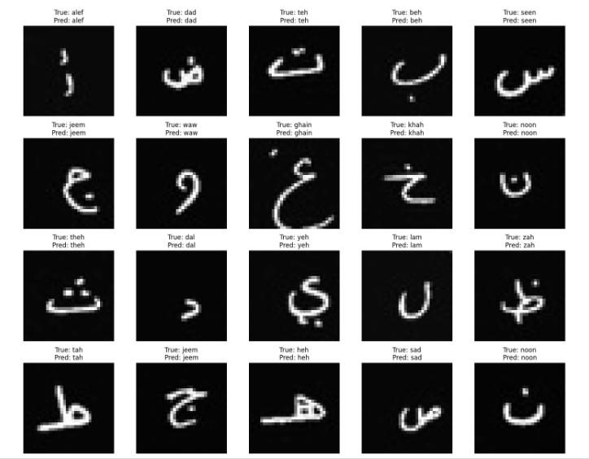
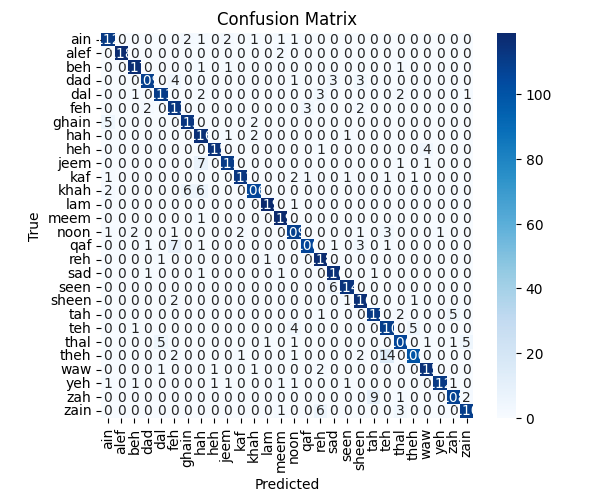

# ✍️ Arabic Handwritten Character Recognition

## Project Overview
Developed a Convolutional Neural Network (CNN) model for recognizing handwritten Arabic characters from individual image samples. The model classifies each input image into its corresponding Arabic letter by learning spatial patterns and features from the data.

---

## Problem Statement
Handwritten Arabic character recognition is challenging due to variations in handwriting styles, shapes, and image quality. This project aims to build a robust deep learning model that can accurately classify Arabic characters from images.

---

## Technologies Used
- Python
- Jupyter Notebook
- NumPy & Pandas
- Matplotlib
- TensorFlow / Keras (CNN Model)

---

## Model Architecture
- Convolutional Layers (feature extraction)
- Pooling Layers (dimensionality reduction)
- Fully Connected Layers (classification)
- Softmax Activation (final output layer)

---

## Results Summary
The CNN model achieved high performance in recognizing handwritten Arabic characters.

- **Accuracy:** 0.9881

### Evaluation Metrics:

---

## Model Predictions
The trained model was tested on unseen images of handwritten Arabic characters.

### Sample Predictions:

---

## Author
Asma Alshaikh

---

## Notes
This project was developed as part of a deep learning practice using Kaggle notebooks.
